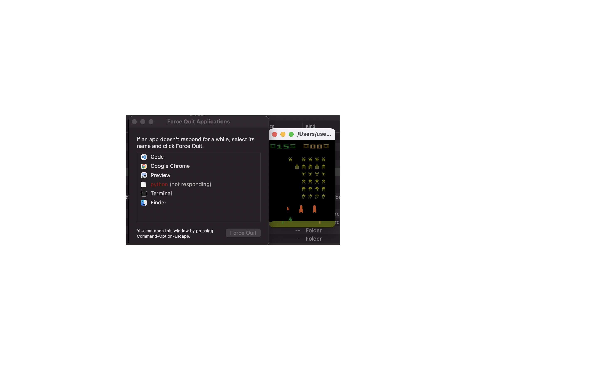
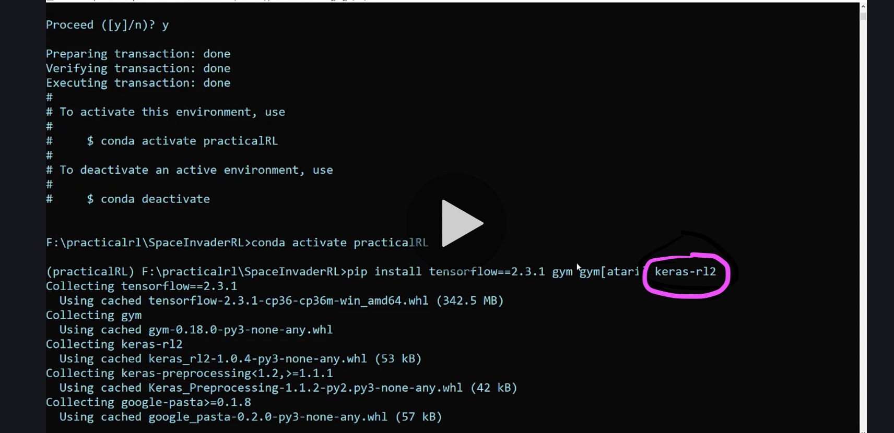
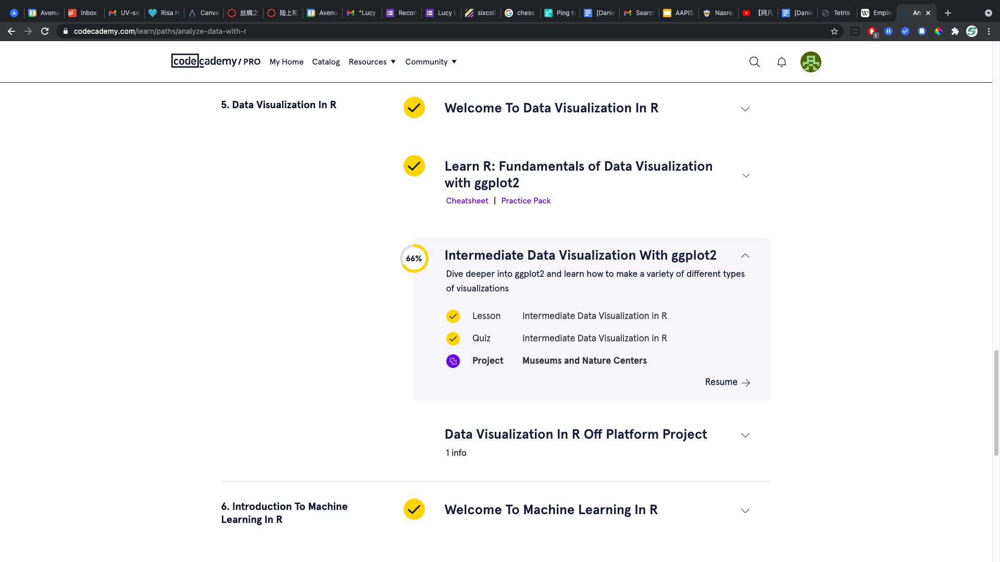
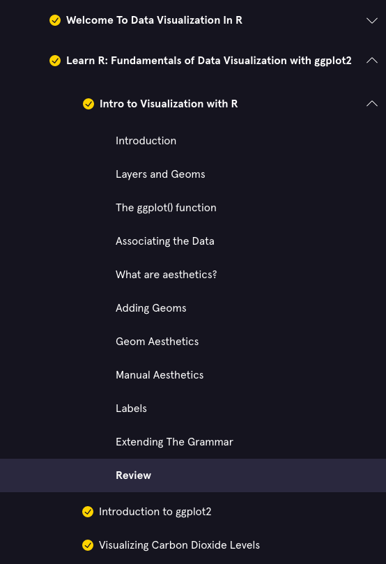
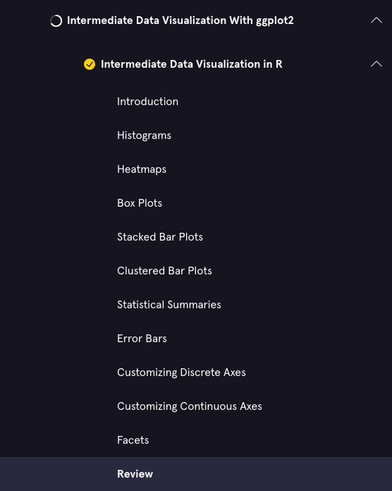
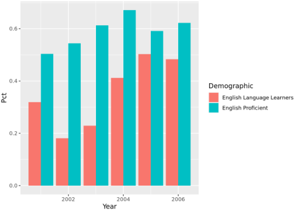

# Tetris A.I Process Journal
Tetris AI Template

#### May 3 - May 9
##### Part I: What did you plan to do this week?
###### To-do List:
- [X] Decide whether or not to use machine learning or decision trees for final project. Do this by exploring machine learning (since I have already explored decision trees).
- [ ] In order to explore machine learning, try to set up a reinforcement learning model using this course on udemy for space invaders: https://www.udemy.com/course/practical-reinforcement-learning/

##### Part II: What did you actually do?
I used the course linked in the to-do list, installing many machine learning and data science packages/frameworks/software:
- tensorflow for machine learning
- openai's gym (specically atari) to set up an environment
- conda for environment control
- jupyter notebooks for ipython.

I already had the other packages installed. I had a TON of trouble with these installations though. I spent a lot of time trying to get tensorflow working, but it just wouldn't function properly. Apparently, I had mistyped the import function "pip install tensorflow==2.3.1 gym gym[atari] keras-rl2" to use a "1" instead of an "l" for the "keras-rl2" part. This seems like a really small and stupid mistake, but I spent so much time trying to figure out what the problem with my computer was. Once I got that to work, when I ran the gym environment, once it finished, it wouldn't close. After a lot of debugging, I realized that it was an iPython specific issue, so I had to research a way to run Python through a script in an interactive way. I also messed up the python version for my conda environment, so I had to restart that as well. 
##### Part III: Was what you actually did different than what you planned? If so, describe how and why? How will you adjust your goals going forward so that they fit more closely with what you actually do?
I talked a lot about this in the previous section, but I never expected to spend so much time with installation errors. There was so many issues that I had to deal with for choosing the right version of a package, which was especially difficult since the course assumed the usage of Windows whereas I used a Mac with the M1 chip, meaning that I need to download special versions of everything. In the future, I will be much more careful with making sure that I install the right version of things.
##### Part IV: What did you learn or discover that you didn't know before this week? What, if anything, surprised you?
I didn't know that MacM1 used a different assembly language (?) called arm64 rather than something called x86. I also didn't know that typefaces could be so important! If the letters in the course had a more prominent serif, I could've been able to better distinguish between "l" and "1". 

#### April 26 - May 2
##### Part I: What did you plan to do this week?
###### To-do List:
- [X] Learn about AI and see if I should use that or algorithms for my final solution.

##### Part II: What did you actually do?
I watched two videos about Machine Learning. [One](https://www.youtube.com/watch?v=r0Ogt-q956I&ab_channel=ACMSIGGRAPH) of them was a lecture, and the [other](https://www.youtube.com/watch?v=aircAruvnKk&ab_channel=3Blue1Brown) was by 3blue1brown, a math Youtuber. This fulfilled my original goal to learn about whether or not I could use AI. I think that I can definitely use it for this type of project, but given the current timeframe, I probably can't accomplish it by the END of this term. We'll see.

In learning about machine learning, I realized how important it was to use simple data visualizations to show the progress of a model, so I decided to learn more about that. I was already in progress self learning some R, and I saw that there was a section about Data Visalization, so I worked all the way up to that.

I learned about data visualization through a codecademy course. This learning is important for my project because I will need to know how to visualize data of how my program is improving. I've been working through this course independantly, and the next step of this course will actually be about machine learning, so I plan to do that soon. Here's a screenshot of the syllabus (the progress bars prove that I've completed the work): .

Here's the content of the courses: 

I will most likely be using these graphing skills in showing the improvement of my tetris-ai (which is necessary since it is much more complex and takes more time than tic-tac-toe, meaning that I need to show whether or not it is improving over time).

Here's an example graph that I made: 
##### Part III: Was what you actually did different than what you planned? If so, describe how and why? How will you adjust your goals going forward so that they fit more closely with what you actually do?
I already talked about this before in Part III, and I talk about this in Part IV, but I originally had no idea that I would be needing to learn how to visualize data. I'm starting to realize that learning about something big is a bit like a roadtrip, with a main path to take, with minor sidetrips to learn about other skills that you originally thought weren't related.

##### Part IV: What did you learn or discover that you didn't know before this week? What, if anything, surprised you?
I didn't initially think at the beginning of the project that I would need to learn how to visualize data for this project, but I ended up doing so after seeing how helpful they were in a lot of AI based lectures. I guess I learned a lot about how a lot of skills and fields are interconnectable and applicable to others!

#### April 9 - April 16
##### Part I: What did you plan to do this week?
I planned to learn more about artificial intelligence concepts, now that I have my basic imaging and tictactoe game set up. This week was more of a "learning" week, since I had just spent a lot of time creating something. 
###### To-do List:
- [X] Learn about artificial intelligence concepts

##### Part II: What did you actually do?
I ended up finding an awesome course called [CS50’s Introduction to Artificial Intelligence with Python](https://cs50.harvard.edu/ai/2020/).
I watched the entire [first lesson](https://cs50.harvard.edu/ai/2020/weeks/0/), which was 2 hours long. It covered Depth First Searches, Breath First Searches, Greedy Best First Searches (and the heuristics required to run those), A* Searches initially. Then, it covered adversarial searching through the usage of minimax algorithm, with alpha beta pruning and depth limitation.
I completed the courses' quiz and scored a perfect score: 
I am currently beginning the project homework of this course.
##### Part III: Was what you actually did different than what you planned? If so, describe how and why? How will you adjust your goals going forward so that they fit more closely with what you actually do?
I didn't do anything different than what I planned, because my goals this week were quite loose and exploratory (in comparison to last week).
##### Part IV: What did you learn or discover that you didn't know before this week? What, if anything, surprised you?
I learned a ton about different search algorithms, and I realized that they were applicable not only to artificial intelligence but to programming data structures. Moreover, I learned how programming is a lot easier when ideas are presented well. The presenter in the lectures is very good at explaining concepts, and has an AMAZING slideshow with great visuals showing every single step so that I can follow along with ease.

##### Note
This week's process journal is a lot shorter and simpler than last weeks because I was just exploring a topic, rather than creating something. This week's acquire skills will be shown during the next week, when I complete my tictactoe artificial intelligence opponent.

#### April 2 - April 9
#### Tetris A.I Project
##### Part I: What did you plan to do this week?
I am planning to make a tictactoe artificial intelligence player to get some experience with all the concepts I will need for my tetris project.

###### To-do List:
- [X] Program a tictactoe game in Pygame
- [X] Program an opponent for that tictactoe game.
- [X] Make an imaging program that takes the screenshot of a tictactoe game image whenever "SPACE" or "ARROW KEYS" are pressed.
- [X] Use the images that were recorded in the program to output an numpy array and the coordinates of the cursor in the imaging program.
- [ ] (If time allows) Learn about machine learning.

##### Part II: What did you actually do?
I was able to do all of the goals above except for the last one (which I didn't plan to do anyway, I just wanted to set that goal for the future and in case I finished everything this week already). 

I ended up spending a TON of time this week doing all of the tictactoe game programming (both the game and the opponent), as well as the imaging program. 

I estimate that I spent around 10 hours on all things combined. There were tons of errors that I had to deal with and I had to mess around with the configuration of many different Python imaging packages. I originally used pyautogui and PIL for taking the screenshot, but it was taking screenshots really slow due to the way that MacOS works, so I had to do some really deep digging to find the mss package, which is much faster. I also had to figure out how to do key inputs for my imaging program to detect whenever a key is pressed, which brought me to the process of choosing between polling or broadcasting.

Finally, after I figured everything out, I had to make it so that the OpenCV could read the image pixels and output a numpy array.

Here is a video of everything in action: [https://youtu.be/p3TDLD6Ikd4](https://youtu.be/p3TDLD6Ikd4)

<!-- blank line -->
<figure class="video_container">
  <iframe src="https://youtube.com/embed/p3TDLD6Ikd4" frameborder="0" allowfullscreen="true"> </iframe>
</figure>
<!-- blank line -->

Here is the code: [https://github.com/daniel-chuang/tictactoe-ai](https://github.com/daniel-chuang/tictactoe-ai)

##### Part III: Was what you actually did different than what you planned? If so, describe how and why? How will you adjust your goals going forward so that they fit more closely with what you actually do?
The things that I did this week were the same as what I planned (this week).

##### Part IV: What did you learn or discover that you didn't know before this week? What, if anything, surprised you?
I learned that MacOS has a very weird screenshotting system, meaning that if I use a normal screenshot function from PIL or pyautogui, it will be INCREDIBLY slow.

I also learned that I can run two Python programs simultaneously through terminal using os.system.

I also learned how to use pynput, which broadcasts whenever a key is pressed. I'm pretty sure that pynput uses multithreading, so that's how that works.

I am going to learn how to implement basic machine learning algorithms next week, most likely through the [Harvard CS50 Machine Learning Class](https://cs50.harvard.edu/ai/2020/), or through the [Codecademy](https://www.codecademy.com/).

#### Ethics Project:
##### What did you do to move your project forward with your partner this week?
Final Position Paper Link: [https://docs.google.com/document/d/1VKxIJWV_r6x4_YkmF8lySWUZQmkHd-Vxrp9BFuAKbvg/edit](https://docs.google.com/document/d/1VKxIJWV_r6x4_YkmF8lySWUZQmkHd-Vxrp9BFuAKbvg/edit)

Final Presentation Link: [https://docs.google.com/presentation/d/1qI1vRSgysdN-25U2J6AQAey1-67Kv6D_EJoZkeuDg6Y/edit?usp=sharing](https://docs.google.com/presentation/d/1qI1vRSgysdN-25U2J6AQAey1-67Kv6D_EJoZkeuDg6Y/edit?usp=sharing)

We finished our project this week! We spent a long time making both the slides and the position paper, as well as researching the topic. I certainly learned a lot. I also used a darkweb dataset [https://www.kaggle.com/philipjames11/dark-net-marketplace-drug-data-agora-20142015](https://www.kaggle.com/philipjames11/dark-net-marketplace-drug-data-agora-20142015) to create a chart for our presentation!

##### What are 1-2 things you can do next week to move the project forward with your partner?
Not applicable, Kai and I already finished! I might keep on using dark web databases for practice making charts in the future though!

#### March 23 - March 25
##### To-do List:
- [X] Learn About OpenCV and Image Recognition
- [X] Learn About Numpy 
- [X] Complete some type of image recognition basic program by end of week.
- [X] Learn About Programs interacting with games through GUI.
- [ ] Make some type of GUI automated random gameplay.
- [X] If time allows: learn about AI theory.
##### Notes:
I learned about OpenCV and Image Recognition. Here's the breakdown on the different things that I learned/did:

1. Learn about Numpy. I learned about Numpy through this website: [https://www.pythonlikeyoumeanit.com/module_3.html](https://www.pythonlikeyoumeanit.com/module_3.html).
I read through every page in that module, meaning I know about different array attributes, functions, iterations, operations, slicing, and indexing. This is particularly important for my ventures into OpenCV, since OpenCV is quite reliant on Numpy concepts.
2. Importing OpenCV (which was suprisingly difficult, since I had some installation issues and Anaconda environment problems).
3. Loading images and understanding the data structure for those images.
4. Image indexing, slicing, and channels. I learned that 3-channel images are three dimensional arrays, where the three axis are width, height, and channels (RGB, or BGR as OpenCV likes to have it).
5. Image Thresholding. I learned how to use image thresholding to isolate certain values given channel parameters. This will be useful for my Tetris AI program, since all the colored blocks will be colored, and everything empty will be black, so this is really applicable. I learned about all the different types of threshold (such as binary, binary inverse, truncated, toZero, toZero inverse, adaptive gaussian, adaptive mean).

6. Bitwise Image Operations and Masking. This is important for actually masking the mask over the original image once you hold the threshold.
7. I learned a ton of other things about OpenCV, but the most important concept that I learned for my game (since edge detection, hough transforms, SIFT and SUFT aren't really needed for my program) was template matching. I can potentially just apply a picture of a block and use that to template match through images of the Tetris gamescreen if I don't decide to use a threshold.
8. I learned about how graphs and weighted edges work. I learned about the basics of different Tree traversals, such as BFT, DFT, and Uniform Search. 

#### March 15 - March 22
##### To-do List:
- [ ] Learn About OpenCV and Image Recognition
- [ ] Complete some type of image recognition basic program by end of week.
- [ ] Learn About Programs interacting with games through GUI.
- [ ] Make some type of GUI automated random gameplay.
- [ ] If time allows: learn about AI.

##### Notes:
I didn't complete any of the above, because I ended up taking a very different course of learning! I learned how to version projects using Git (Command Line Interface, because it's cooler) and Github. Here are three deliverables to prove that I did that:

###### [learngitbranching.js](https://learngitbranching.js.org/)

###### Git-it

###### Github Pages Website
You are currently on a website that I made using Github Pages and version control! I will constantly be using the concepts that I learned about version control not only for my actual project but also for this process journal. Therefore, this website is another example of my learning in source control that will continue to evolve as I progress in my project.